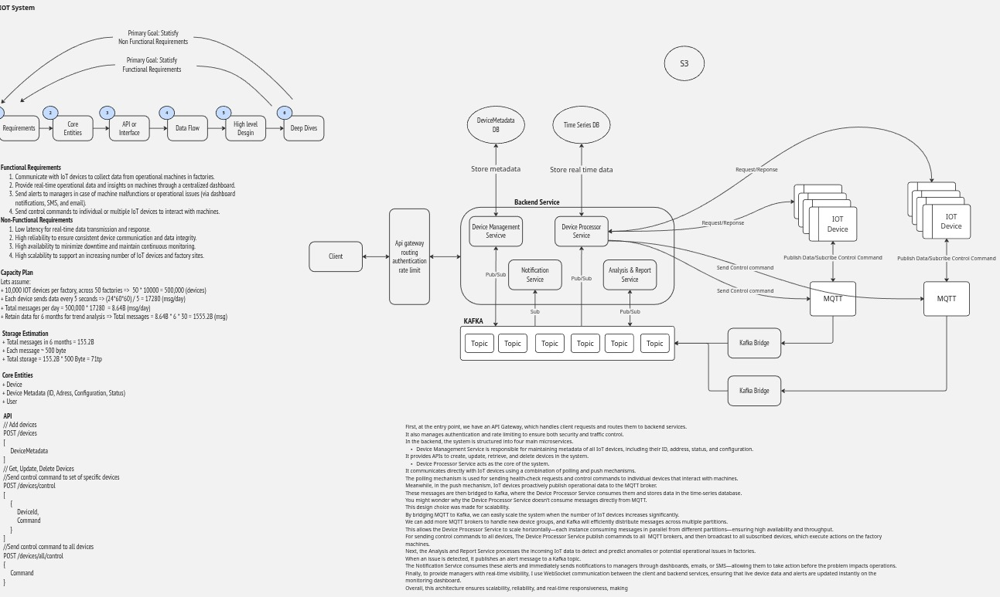

# IoT Microservices System

A comprehensive IoT system designed to collect data from factory machines, provide real-time insights, send alerts, and allow control commands to devices. Built with Spring Boot 3, Java JDK 25, and microservices architecture.



## 🏗️ System Architecture

The system follows a microservices architecture with the following components:

- **API Gateway**: Entry point for all client requests with routing and authentication
- **Device Management Service**: Manages device metadata and CRUD operations
- **Device Processor Service**: Handles MQTT communication and data processing
- **Analysis & Report Service**: Performs anomaly detection and generates reports
- **Notification Service**: Sends alerts via dashboard, email, and SMS with WebSocket support

## 📊 System Design Overview

### Functional Requirements
1. Communicate with IoT devices to collect data from operational machines in factories
2. Provide real-time operational data and insights through a centralized dashboard
3. Send alerts to managers for machine malfunctions or operational issues
4. Send control commands to individual or multiple IoT devices

### Non-Functional Requirements
- **Low Latency**: Real-time data transmission and response
- **High Reliability**: Consistent device communication and data integrity
- **High Availability**: Minimal downtime and continuous monitoring
- **High Scalability**: Support for increasing number of IoT devices and factory sites

### Capacity Planning
- **Scale**: 500,000 IoT devices across 50 factories (10,000 devices per factory)
- **Data Volume**: 8.64 billion messages per day (17,280 messages per device)
- **Storage**: 71 TB for 6 months of data retention
- **Message Size**: 500 bytes per message

## 🚀 Quick Start

### Prerequisites
- Java JDK 25
- Maven 3.8+
- Docker and Docker Compose
- Git

### 1. Clone the Repository
```bash
git clone <repository-url>
cd IOT
```

### 2. Build the Project
```bash
mvn clean install
```

### 3. Start Infrastructure Services
```bash
docker-compose up -d eureka-server zookeeper kafka mosquitto postgres influxdb redis
```

### 4. Start Microservices
```bash
docker-compose up -d
```

### 5. Verify Services
- API Gateway: http://localhost:8080
- Eureka Dashboard: http://localhost:8761
- InfluxDB UI: http://localhost:8086
- Kafka UI: http://localhost:9092

## 🏢 Services Overview

### API Gateway (Port 8080)
- **Purpose**: Central entry point for all client requests
- **Features**: 
  - Request routing to backend services
  - JWT-based authentication
  - Rate limiting and CORS support
  - Load balancing

### Device Management Service (Port 8081)
- **Purpose**: Manages device metadata and configurations
- **Database**: PostgreSQL
- **Features**:
  - CRUD operations for devices
  - Device status tracking
  - Factory-wise device grouping
  - Configuration management

### Device Processor Service (Port 8082)
- **Purpose**: Core service for data processing and device communication
- **Features**:
  - MQTT client for device communication
  - Real-time data processing
  - Time series data storage (InfluxDB)
  - Control command dispatch
  - Anomaly detection

### Analysis & Report Service (Port 8083)
- **Purpose**: Advanced analytics and reporting
- **Features**:
  - Statistical anomaly detection
  - Trend analysis
  - Pattern recognition
  - Performance reports
  - Factory-wide analytics

### Notification Service (Port 8084)
- **Purpose**: Multi-channel notification system
- **Features**:
  - WebSocket for real-time updates
  - Email notifications
  - SMS alerts
  - Dashboard notifications
  - Severity-based routing

## 📡 Communication Flow

### Data Flow
1. **IoT Devices** → **MQTT Broker** → **Device Processor Service**
2. **Device Processor Service** → **InfluxDB** (Time Series Storage)
3. **Device Processor Service** → **Kafka** → **Analysis Service**
4. **Analysis Service** → **Kafka** → **Notification Service**
5. **Notification Service** → **WebSocket/Email/SMS**

### Control Flow
1. **Client** → **API Gateway** → **Device Processor Service**
2. **Device Processor Service** → **MQTT Broker** → **IoT Devices**

## 🗄️ Data Storage

### PostgreSQL (Device Metadata)
- Device information and configurations
- Factory and location data
- Device status and health

### InfluxDB (Time Series Data)
- Real-time sensor data
- Performance metrics
- Historical trends

### Kafka (Message Streaming)
- Inter-service communication
- Event streaming
- Data pipeline

## 🔧 Configuration

### Environment Variables
```bash
# Database
POSTGRES_DB=iot_devices
POSTGRES_USER=iot_user
POSTGRES_PASSWORD=iot_password

# InfluxDB
INFLUXDB_TOKEN=my-token
INFLUXDB_ORG=iot-org
INFLUXDB_BUCKET=iot-data

# MQTT
MQTT_BROKER_URL=tcp://localhost:1883

# Kafka
KAFKA_BOOTSTRAP_SERVERS=localhost:9092

# Email (Optional)
MAIL_USERNAME=your-email@gmail.com
MAIL_PASSWORD=your-app-password

# SMS (Optional)
SMS_API_KEY=your-sms-api-key
```

## 📊 API Endpoints

### Device Management
```bash
# Create device
POST /api/devices
{
  "name": "Temperature Sensor 1",
  "address": "192.168.1.100",
  "type": "SENSOR",
  "status": "ONLINE",
  "factoryId": "factory-001",
  "location": "Production Line A"
}

# Get all devices
GET /api/devices

# Get device by ID
GET /api/devices/{id}

# Update device
PUT /api/devices/{id}

# Delete device
DELETE /api/devices/{id}
```

### Device Control
```bash
# Send control command to specific device
POST /api/processor/devices/{deviceId}/control
{
  "commandId": "cmd-001",
  "commandType": "START",
  "payload": "start_operation"
}

# Send broadcast command to all devices
POST /api/processor/devices/all/control
{
  "commandId": "cmd-002",
  "commandType": "EMERGENCY_STOP",
  "payload": "emergency_stop"
}
```

### Analysis & Reports
```bash
# Get device report
GET /api/analysis/devices/{deviceId}/report?hours=24

# Get factory report
GET /api/analysis/factories/{factoryId}/report?hours=24

# Get anomaly report
GET /api/analysis/anomalies/report?hours=24

# Get performance report
GET /api/analysis/devices/{deviceId}/performance?hours=24
```

### Notifications
```bash
# Send custom notification
POST /api/notifications
{
  "type": "EMAIL",
  "title": "Alert",
  "message": "Device offline",
  "recipients": ["admin@factory.com"]
}

# Get notification stats
GET /api/notifications/stats
```

## 🔌 WebSocket Connection

Connect to real-time notifications:
```javascript
const ws = new WebSocket('ws://localhost:8080/ws/notifications');

ws.onopen = function() {
    // Subscribe to notifications
    ws.send(JSON.stringify({
        type: 'subscribe',
        subscriptionType: 'all'
    }));
};

ws.onmessage = function(event) {
    const data = JSON.parse(event.data);
    console.log('Notification:', data);
};
```

## 🧪 Testing

### Unit Tests
```bash
mvn test
```

### Integration Tests
```bash
mvn verify
```

### Load Testing
```bash
# Test MQTT message throughput
mosquitto_pub -h localhost -t "devices/test-device/data" -m '{"temperature": 25.5, "pressure": 2.1}'

# Test API endpoints
curl -X GET http://localhost:8080/api/devices
```

## 📈 Monitoring

### Health Checks
- API Gateway: http://localhost:8080/actuator/health
- Device Management: http://localhost:8081/actuator/health
- Device Processor: http://localhost:8082/actuator/health
- Analysis Service: http://localhost:8083/actuator/health
- Notification Service: http://localhost:8084/actuator/health

### Metrics
- Spring Boot Actuator endpoints
- InfluxDB metrics dashboard
- Kafka monitoring tools

## 🚀 Deployment

### Docker Deployment
```bash
# Build all services
docker-compose build

# Start all services
docker-compose up -d

# View logs
docker-compose logs -f

# Scale services
docker-compose up -d --scale device-processor-service=3
```

### Production Considerations
1. **Security**: Enable authentication, use HTTPS, secure MQTT
2. **Scaling**: Horizontal scaling with load balancers
3. **Monitoring**: Implement comprehensive logging and monitoring
4. **Backup**: Regular database backups and disaster recovery
5. **Network**: Secure network configuration and firewalls

## 🔧 Development

### Adding New Features
1. Create feature branch
2. Implement changes
3. Add tests
4. Update documentation
5. Create pull request

### Code Structure
```
├── api-gateway/           # API Gateway service
├── device-management-service/  # Device management
├── device-processor-service/   # Data processing
├── analysis-report-service/    # Analytics
├── notification-service/       # Notifications
├── common/                     # Shared DTOs
├── docker-compose.yml         # Infrastructure
└── README.md                  # Documentation
```

## 📝 License

This project is licensed under the MIT License - see the LICENSE file for details.

## 🤝 Contributing

1. Fork the repository
2. Create a feature branch
3. Commit your changes
4. Push to the branch
5. Create a Pull Request

## 📞 Support

For support and questions:
- Create an issue in the repository
- Contact the development team
- Check the documentation wiki

---

**Built with ❤️ using Spring Boot 3, Java JDK 25, and modern microservices architecture**
