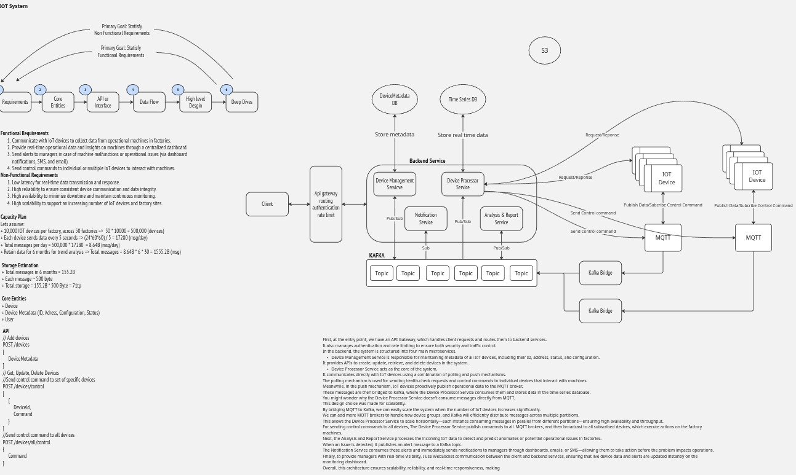

# IoT Platform

This repository contains an IoT platform for factory device monitoring, control, anomaly detection, and alerting. It combines backend microservices, a React dashboard, infrastructure services, and simulated devices for local testing.



## Overview

At a high level, the platform supports:

- ingesting device telemetry over MQTT
- bridging MQTT traffic into Kafka
- storing time-series data in InfluxDB
- storing metadata and users in PostgreSQL
- exposing APIs through a gateway
- generating alerts and dashboard notifications
- testing the stack with mock IoT devices

## High-Level Design

### Architecture Layers

| Layer | Purpose | Main Components |
| --- | --- | --- |
| Edge ingestion | Receive telemetry and commands from devices | Mosquitto, mock devices, device-processor-service |
| Event backbone | Decouple producers and consumers | Kafka, Kafka Connect MQTT bridge |
| Business services | Manage metadata, analytics, alerts, auth | device-management-service, analysis-report-service, notification-service, user-service |
| Experience layer | User-facing access and visualization | api-gateway, frontend |

### Core Components

| Component | Responsibility | Main Dependencies |
| --- | --- | --- |
| `api-gateway` | Single entry point for REST and WebSocket traffic | Eureka, user-service, backend services |
| `device-management-service` | CRUD and status for devices | PostgreSQL, Kafka |
| `device-processor-service` | MQTT integration and time-series persistence | Mosquitto, Kafka, InfluxDB |
| `analysis-report-service` | Anomaly detection and reporting | Kafka, InfluxDB |
| `notification-service` | Dashboard, email, SMS, WebSocket notifications | Kafka, WebSocket, SMTP, SMS provider |
| `user-service` | Authentication and user management | PostgreSQL, JWT |
| `frontend` | Dashboard UI for operations and monitoring | API Gateway, WebSocket |
| `mosquitto` | MQTT broker for device traffic | TLS/auth/ACL optional |
| `kafka` | Event streaming backbone | Kafka Connect, services |
| `mqtt-kafka-bridge` | Kafka Connect bridge from MQTT to Kafka | Mosquitto, Kafka |
| `postgres` | Relational storage for metadata and users | device-management-service, user-service |
| `influxdb` | Time-series storage for telemetry | device-processor-service, analysis-report-service |
| `redis` | Optional cache | backend services |
| `eureka-server` | Service discovery | backend services |

### Telemetry Flow

1. Devices publish telemetry to Mosquitto on topics such as `iot/sensors/...`.
2. Kafka Connect subscribes to MQTT and forwards messages to Kafka, commonly `mqtt-messages`.
3. `device-processor-service` consumes `mqtt-messages`.
4. The processor republishes a canonical raw event to `device.data.raw.high-throughput`.
5. The processor writes time-series points into InfluxDB and republishes a canonical normalized event to `device.data.processed.high-throughput`.
6. Analytics services consume normalized telemetry to detect anomalies and generate alerts on `device.alerts.high-integrity`.
7. Invalid ingress payloads are published to `device.processing.dlq`.
8. `notification-service` broadcasts alert results to WebSocket clients and optional email/SMS channels.
9. The React frontend receives live updates through the gateway.

### Control Flow

1. A dashboard user sends a command through the frontend.
2. The request enters via `api-gateway`.
3. The gateway routes to `device-processor-service`.
4. The processor publishes the command to the device over MQTT.
5. Device responses and status updates flow back through MQTT, Kafka, and downstream services.

### Metadata and Status Flow

1. Device CRUD requests go through `api-gateway` to `device-management-service`.
2. Metadata is stored in PostgreSQL.
3. Device metadata and status changes are published to Kafka topics such as:
   - `device.metadata.updates`
   - `device.status.changes.high-integrity`
4. Consumers such as `notification-service` react to those events.

### Event Topic Model

The event backbone is split by both layer and delivery class.

#### Topic layers

| Layer | Topic | Purpose | Delivery class |
| --- | --- | --- | --- |
| MQTT ingress | `mqtt-messages` | Kafka Connect landing topic for MQTT payloads | bridge ingress |
| Raw telemetry | `device.data.raw.high-throughput` | canonical raw telemetry event after decode | high-throughput |
| Normalized telemetry | `device.data.processed.high-throughput` | validated event for analytics and downstream consumers | high-throughput |
| Device status | `device.status.changes.high-integrity` | canonical status transitions | high-integrity |
| Alerts | `device.alerts.high-integrity` | actionable alerts and anomalies | high-integrity |
| DLQ | `device.processing.dlq` | failed decode/normalize/store events | operational |

#### Delivery classes

- `high-throughput`: telemetry-heavy flows where throughput matters more than strict end-to-end delivery semantics
- `high-integrity`: lower-volume business-critical events such as alerts, commands, and status transitions
- `operational`: failure, recovery, and troubleshooting events such as DLQ messages

### Canonical Event Schemas

#### Canonical telemetry event

Produced by `device-processor-service` on raw and normalized telemetry topics.

```json
{
  "eventId": "4dc6b0f5-8d57-4e18-9f77-a4c3c2f9a43c",
  "traceId": "0ee7a9ff-5d80-43bb-92cb-16720efe4fa0",
  "schemaVersion": "1.0",
  "producerService": "device-processor-service",
  "sourceProtocol": "MQTT",
  "sourceTopic": "mqtt-messages",
  "layer": "raw",
  "pipeline": "high-throughput",
  "deviceId": "iot_device_01",
  "factoryId": "factory-001",
  "location": "line-a",
  "messageType": "sensor_data",
  "occurredAt": "2026-06-08T10:15:00",
  "ingestedAt": "2026-06-08T10:15:01",
  "payload": {
    "deviceId": "iot_device_01",
    "timestamp": "2026-06-08T10:15:00",
    "factoryId": "factory-001",
    "location": "line-a",
    "messageType": "sensor_data",
    "batteryLevel": 95.2,
    "signalStrength": -45,
    "data": {
      "temperature": 25.5,
      "humidity": 45.2
    }
  }
}
```

#### Canonical device status event

Produced by `device-management-service`.

```json
{
  "eventId": "5dc6d4a6-c1f7-4ba1-8a85-0f40cb87cbe7",
  "traceId": "12f3c6d9-0c11-4de3-a782-42bd275d15d4",
  "schemaVersion": "1.0",
  "producerService": "device-management-service",
  "pipeline": "high-integrity",
  "deviceId": "device-001",
  "deviceName": "Temperature Sensor 1",
  "factoryId": "factory-001",
  "previousStatus": "ONLINE",
  "currentStatus": "OFFLINE",
  "changedAt": "2026-06-08T10:30:00"
}
```

#### DLQ event

Produced by `device-processor-service` when ingress decode or normalization fails.

```json
{
  "eventId": "fe6c4f58-7ceb-4631-9214-22d37016578b",
  "traceId": "4b93fb66-0f81-4cd3-b4a9-c2176c7b4a2b",
  "schemaVersion": "1.0",
  "producerService": "device-processor-service",
  "failedTopic": "mqtt-messages",
  "failedStage": "decode-or-normalize",
  "pipeline": "high-throughput",
  "errorMessage": "Illegal base64 character",
  "originalPayload": "not-base64",
  "occurredAt": "2026-06-08T10:45:00"
}
```

### Event Tracing Headers

The services now propagate event metadata in Kafka headers to make troubleshooting and replay easier.

| Header | Meaning |
| --- | --- |
| `event_id` | unique event identifier |
| `trace_id` | shared flow identifier across derived events |
| `event_type` | semantic type such as raw telemetry, normalized telemetry, or alert |
| `pipeline` | `high-throughput` or `high-integrity` |
| `layer` | `raw` or `normalized` for telemetry |
| `schema_version` | contract version |
| `producer_service` | service that produced the event |
| `source_topic` | upstream topic used to create the event |
| `failed_stage` | failure stage for DLQ events |

### Shared Kafka Configuration

Kafka serialization and listener behavior are centralized in `common` so the services do not drift over time.

Shared config entry point:

- [CommonKafkaConfiguration.java](/home/sangle/codex/IOT/common/src/main/java/com/iot/common/config/CommonKafkaConfiguration.java)

What it standardizes:

- JSON producer serialization for canonical events
- JSON consumer deserialization with trusted packages
- preserved Spring type headers for polymorphic event consumption
- a default JSON listener container factory for business events
- a separate string listener container factory for raw Kafka Connect ingress in `device-processor-service`

### Storage Model

| Store | Data Type | Used For |
| --- | --- | --- |
| PostgreSQL | transactional relational data | devices, users, configuration, statuses |
| InfluxDB | time-series telemetry | sensor values, trends, time-based analytics |
| Kafka | event log / stream transport | service-to-service async communication |
| Redis | cache / transient state | optional acceleration and state sharing |

### Security Model

The repo documents a staged security model:

- JWT at the API layer via `api-gateway`
- MQTT username/password authentication
- MQTT ACL enforcement by topic
- TLS for broker transport on port `8883`
- mutual TLS for devices and the Kafka bridge
- separate Root CA, Server CA, and Device CA

### Secure MQTT to Kafka Design

This is the high-level design for the secure telemetry path when devices connect with certificates and Kafka Connect bridges MQTT messages into Kafka.

#### Main components

| Component | Role | Trust material used |
| --- | --- | --- |
| IoT device | publishes telemetry and receives commands | device certificate, device private key, trusted broker CA bundle |
| Mosquitto broker | terminates TLS, authenticates clients, enforces topic access | server certificate, server private key, trusted client CA bundle |
| Kafka Connect MQTT source | subscribes to MQTT topics and forwards payloads to Kafka | `kafka_bridge` certificate, `kafka_bridge` private key, trusted broker CA bundle |
| Kafka | durable transport for downstream processing | no MQTT certs, receives data from Kafka Connect |
| `device-processor-service` | consumes bridged MQTT payloads from Kafka | Kafka connectivity, downstream application config |

#### Trust model

The certificate hierarchy is intentionally split:

- `Root CA`: top-level trust anchor
- `Server CA`: signs the Mosquitto server certificate
- `Device CA`: signs client certificates for devices, health checks, and `kafka_bridge`

This separation matters because:

- broker identity and device identity are managed independently
- client certificate rotation does not require replacing broker certificates
- Mosquitto can trust a device/client CA without using the same signing chain for the server certificate

#### Connection model

Each device holds:

- its own private key
- its own client certificate
- the CA bundle needed to verify the broker certificate

Mosquitto holds:

- `server.key`
- `server.crt`
- trusted CA chain for client verification

Kafka Connect holds:

- `kafka_bridge` client certificate and key
- a truststore that validates the broker certificate
- a keystore used for mutual TLS client authentication

#### Data flow with mutual TLS

1. A device opens a TLS connection to Mosquitto on port `8883`.
2. The device verifies the broker certificate against `ca-bundle.crt`.
3. Mosquitto verifies the device certificate against the client trust chain derived from the device CA.
4. After TLS authentication succeeds, the device publishes telemetry to topics such as `iot/sensors/{deviceId}`.
5. Kafka Connect uses the `kafka_bridge` client certificate to open its own mutual TLS session to Mosquitto.
6. Kafka Connect subscribes to `iot/sensors/#`.
7. Kafka Connect forwards MQTT payloads into Kafka topic `mqtt-messages`.
8. `device-processor-service` consumes `mqtt-messages` and writes normalized telemetry into InfluxDB.
9. Downstream services perform analytics, alerting, and WebSocket notification delivery.

#### Sequence diagram

```text
IoT Device                           Mosquitto                         Kafka Connect                    Kafka                     Device Processor
    |                                    |                                  |                             |                               |
    | -- TLS connect : cert+key -------> |                                  |                             |                               |
    | <- server cert ------------------- |                                  |                             |                               |
    | -- verify broker via CA bundle --> |                                  |                             |                               |
    |                                    | -- verify device via Device CA ->|                             |                               |
    |                                    |                                  |                             |                               |
    | -- publish iot/sensors/... ------> |                                  |                             |                               |
    |                                    | <--- TLS connect : kafka_bridge cert+key ---                  |                               |
    |                                    | ---> server cert ------------------------------               |                               |
    |                                    | <--- subscribe iot/sensors/# ------------------               |                               |
    |                                    | -- deliver MQTT payload -----------------------> |             |                               |
    |                                    |                                  | -- produce mqtt-messages -->|                               |
    |                                    |                                  |                             | -- consume mqtt-messages ----> |
    |                                    |                                  |                             |                               | -- write to InfluxDB
```

Read it as two separate mutual TLS client sessions:

- device to Mosquitto
- Kafka Connect to Mosquitto

Mosquitto is the TLS server in both sessions. Devices and `kafka_bridge` are independent TLS clients with separate client certificates.

#### Why `kafka_bridge` needs its own certificate

`kafka_bridge` is a machine client, just like a device, but with broader subscription scope. It needs its own certificate so that:

- Mosquitto can identify it independently from device clients
- ACL rules can allow it to read `iot/sensors/#`
- the bridge can be revoked or rotated without affecting device certificates

#### Topic and access design

A clean production model is:

- devices can only publish to their own topic namespace
- devices should not subscribe to other device topics
- `kafka_bridge` can subscribe to the full telemetry topic tree
- control publishers should be limited to command topics

Example policy shape:

- device `iot_device_01` publishes only to `iot/sensors/iot_device_01/#`
- `kafka_bridge` subscribes to `iot/sensors/#`
- backend control clients publish to device control topics only

#### MQTT ACL mapping by certificate identity

Certificate Common Name should map directly to the MQTT principal used in ACL rules.

| Certificate CN | Intended identity | Publish | Subscribe |
| --- | --- | --- | --- |
| `iot_device_01` | single device client | `iot/sensors/iot_device_01/#` | optional own command/status topics only |
| `kafka_bridge` | Kafka Connect MQTT source | none required for ingest-only bridge | `iot/sensors/#` |
| `healthcheck` | broker health probe | `health/ping` only if needed | `health/ping` |
| backend control publisher | trusted backend command client | `devices/+/control` or chosen command namespace | none unless command responses are needed |

Recommended rule shape:

- device cert CN equals device ID
- ACL path is derived from certificate CN
- bridge identity is separate from device identities
- bridge gets read access to telemetry, not broad write access

#### Security boundaries

This design gives you three separate controls:

- TLS identity: certificate proves who the client is
- broker trust: CA chain determines which certificates are accepted
- authorization: Mosquitto ACLs determine what an authenticated client may publish or subscribe to

That means a valid certificate alone should not imply full MQTT access. The certificate gets the client authenticated; ACL rules should still restrict the topic scope.

#### Operational certificate mapping

| File | Used by | Purpose |
| --- | --- | --- |
| `server.crt` / `server.key` | Mosquitto | broker TLS identity |
| `rootCA.crt` | clients and truststores | root trust anchor |
| `serverCA.crt` | Kafka Connect truststore build | broker chain validation |
| `deviceCA.crt` | Mosquitto client verification | trust issued device/client certs |
| `healthcheck.crt` / `healthcheck.key` | container health check | verify broker accepts client auth |
| `kafka_bridge.crt` / `kafka_bridge.key` | Kafka Connect | mutual TLS bridge identity |
| `iot_device_01.crt` / `iot_device_01.key` | device client | mutual TLS device identity |
| `ca-bundle.crt` | devices and Kafka Connect | validate broker certificate chain |
| `device-ca-bundle.crt` | broker-side trust workflows | validate device/client certificate chain |

#### Design constraints in this repo

In the current repo design:

- secure MQTT is expected to run on port `8883`
- Kafka Connect is the bridge between MQTT and Kafka
- Kafka Connect forwards MQTT payloads to `mqtt-messages`
- `device-processor-service` is the first backend consumer after the bridge

So if TLS MQTT ingestion fails, the first things to validate are:

1. Mosquitto server cert and key
2. device or `kafka_bridge` cert chain
3. CA bundles and truststores
4. Mosquitto ACL rules
5. Kafka Connect connector TLS config

## Repository Structure

```text
.
├── api-gateway/
├── analysis-report-service/
├── common/
├── device-management-service/
├── device-processor-service/
├── frontend/
├── kafka-connect/
├── mock-iot-devices/
├── mosquitto/
├── notification-service/
└── user-service/
```

## Ports

### Application ports from service configs

| Service | Internal App Port |
| --- | --- |
| `api-gateway` | `9080` |
| `device-management-service` | `9081` |
| `device-processor-service` | `9082` |
| `analysis-report-service` | `9083` |
| `notification-service` | `9084` |
| `user-service` | `9085` |

### Infrastructure ports

| Component | Port |
| --- | --- |
| Eureka | `8761` |
| PostgreSQL | `5432` |
| InfluxDB | `8086` |
| Redis | `6379` |
| Kafka | `9092` / `9093` / `29092` internal |
| Mosquitto plain MQTT | `1883` |
| Mosquitto TLS MQTT | `8883` |
| Mosquitto WebSocket | `9001` |
| Mosquitto TLS WebSocket | `9002` |
| Kafka Connect REST | `8083` in system compose files |
| Frontend dev server | `3000` |

## Docker Compose Topology

| File | Purpose |
| --- | --- |
| `docker-compose.yml` | core backend app stack: services, Postgres, InfluxDB, Redis, Eureka |
| `docker-compose-system.yml` | Kafka, Mosquitto, Kafka Connect MQTT bridge |
| `docker-compose-system-tls.yml` | MQTT over TLS with basic cert setup |
| `docker-compose-system-tls-v2.yml` | MQTT TLS with fuller CA/keystore/truststore setup and connector auto-deploy |
| `docker-compose-pre-setup.yml` | pre-setup support |
| `docker-compose-be.yml` | backend-specific compose variant |

Database schema changes are managed by Flyway migrations inside each Spring service, starting with `device-management-service/src/main/resources/db/migration/`.

## Local Startup

1. Start event and broker infrastructure:

```bash
docker compose -f docker-compose-system.yml up -d
```

2. Start backend services:

```bash
docker compose -f docker-compose.yml up -d
```

3. Start the frontend:

```bash
cd frontend
make frontend-setup
npm start
```

4. Optionally start mock devices:

```bash
cd mock-iot-devices
python3 -m venv venv
source venv/bin/activate
pip install -r requirements.txt
python main.py --count 10 --interactive
```

## Deployment

### Prerequisites

#### System requirements

- Linux, macOS, or Windows with WSL2
- minimum 8 GB RAM, recommended 16 GB
- minimum 4 CPU cores, recommended 8
- minimum 50 GB free storage

#### Software requirements

- Java 21
- Maven 3.8+
- Docker 20.10+
- Docker Compose 2+
- Git

#### Useful optional tools

- `mosquitto-clients`
- `curl`
- `jq`
- `wscat`

### Build

```bash
mvn clean install
```

Build a specific service:

```bash
mvn clean install -pl device-management-service
```

### Local Docker deployment

Start infrastructure first:

```bash
docker compose -f docker-compose-system.yml up -d
docker compose -f docker-compose.yml up -d
```

Check service status:

```bash
docker compose -f docker-compose-system.yml ps
docker compose -f docker-compose.yml ps
```

Run smoke checks:

```bash
make smoke
```

### Scaling examples

```bash
docker compose -f docker-compose.yml up -d --scale device-processor-service=3
docker compose -f docker-compose.yml up -d --scale notification-service=2
```

### Production deployment guidance

For production, use a dedicated override such as `docker-compose.prod.yml` for:

- `SPRING_PROFILES_ACTIVE=prod`
- secrets via environment variables
- resource limits and replica counts
- persistent volumes for PostgreSQL, InfluxDB, and Kafka
- reverse proxy or load balancer in front of `api-gateway`
- HTTPS termination and secure MQTT configuration

Recommended production environment variables:

```bash
DB_PASSWORD=secure_password_here
INFLUXDB_TOKEN=secure_token_here
MQTT_BROKER_URL=tcp://mqtt-broker.company.com:1883
JWT_SECRET=very_secure_jwt_secret_key_here
MAIL_USERNAME=alerts@company.com
MAIL_PASSWORD=secure_email_password
SMS_API_KEY=secure_sms_api_key
```

### Production hardening

- disable anonymous MQTT access
- enforce Mosquitto password and ACL files
- prefer TLS or mutual TLS for MQTT
- use least-privilege database users
- place `api-gateway` behind Nginx or another load balancer
- terminate HTTPS at the proxy or ingress layer
- keep backups of PostgreSQL, InfluxDB, compose files, broker config, and environment files

### Monitoring and logging

Recommended monitoring stack:

- Spring Boot Actuator health and metrics
- Prometheus for scraping `/actuator/prometheus`
- Grafana for dashboards
- ELK or equivalent for centralized logs

Useful health endpoints:

- `http://localhost:9080/actuator/health`
- `http://localhost:9081/actuator/health`
- `http://localhost:9082/actuator/health`
- `http://localhost:9083/actuator/health`
- `http://localhost:9084/actuator/health`
- `http://localhost:9085/actuator/health`

### Troubleshooting

#### Services not starting

```bash
docker compose -f docker-compose.yml logs api-gateway
docker compose -f docker-compose.yml ps
docker compose -f docker-compose.yml restart api-gateway
```

#### Database issues

```bash
docker compose -f docker-compose.yml exec postgres pg_isready -U iot_user
curl http://localhost:8086/health
```

#### MQTT issues

```bash
mosquitto_pub -h localhost -t "test/topic" -m "test message"
docker compose -f docker-compose-system.yml logs mosquitto
docker compose -f docker-compose-system.yml restart mosquitto
```

#### Kafka issues

```bash
docker compose -f docker-compose-system.yml exec kafka kafka-topics --bootstrap-server localhost:9092 --list
docker compose -f docker-compose-system.yml exec kafka kafka-consumer-groups --bootstrap-server localhost:9092 --list
```

### Backup and recovery

PostgreSQL backup:

```bash
docker compose -f docker-compose.yml exec postgres pg_dump -U iot_user iot_devices > backup.sql
```

InfluxDB backup:

```bash
docker compose -f docker-compose.yml exec influxdb influx backup /backup/latest
```

Configuration backup:

```bash
tar -czf config_backup.tar.gz docker-compose.yml docker-compose-system.yml mosquitto/config .env
```

PostgreSQL restore:

```bash
docker compose -f docker-compose.yml exec -T postgres psql -U iot_user iot_devices < backup.sql
```

## Backend Behavior

### API Gateway

- routes `/api/devices/**` to `device-management-service`
- routes `/api/processor/**` to `device-processor-service`
- routes `/api/analysis/**` to `analysis-report-service`
- routes `/api/notifications/**` to `notification-service`
- routes `/api/auth/**` to `user-service`
- routes `/ws/**` to notification WebSocket handlers

### Device Management Service

- stores devices in PostgreSQL
- publishes metadata and status events to Kafka
- owns device CRUD lifecycle

### Device Processor Service

- connects to the MQTT broker
- consumes telemetry through the Kafka ingress path
- decodes payloads
- writes telemetry into InfluxDB
- exposes REST endpoints for control commands

### Analysis Report Service

- listens for processed device data
- keeps in-memory history per device
- applies statistical, trend, and simple pattern anomaly detection
- publishes alerts to Kafka

### Notification Service

- consumes `device.alerts.high-integrity`
- sends dashboard notifications
- optionally sends email and SMS by severity
- publishes notification status
- keeps WebSocket sessions for live updates

### User Service

- provides auth and user-management responsibilities
- is present in the Maven build and gateway routing

## API Reference

### Authentication

The platform uses JWT-based authentication. Send the token in the `Authorization` header:

```text
Authorization: Bearer <your-jwt-token>
```

Base API URL through the gateway:

```text
http://localhost:8080/api
```

Note: the gateway service config currently uses internal port `9080`, while older docs and some compose mappings reference `8080`.

### Device Management API

#### Create device

`POST /devices`

```json
{
  "name": "Temperature Sensor 1",
  "address": "192.168.1.100",
  "type": "SENSOR",
  "status": "ONLINE",
  "factoryId": "factory-001",
  "location": "Production Line A",
  "configuration": {
    "sampling_rate": "5",
    "threshold_high": "80",
    "threshold_low": "-10"
  }
}
```

#### Get devices

- `GET /devices`
- `GET /devices/{id}`

Supported filters for `GET /devices`:

- `factoryId`
- `status`
- `type`

#### Update and delete device

- `PUT /devices/{id}`
- `DELETE /devices/{id}`
- `PATCH /devices/{id}/status?status=ONLINE`

#### Device stats

`GET /devices/stats/count`

Example response:

```json
{
  "totalDevices": 150,
  "onlineDevices": 145,
  "offlineDevices": 5
}
```

### Device Control API

#### Send command to one device

`POST /processor/devices/{deviceId}/control`

```json
{
  "commandId": "cmd-001",
  "commandType": "START",
  "payload": "start_operation",
  "parameters": {
    "speed": 100,
    "duration": 300
  },
  "priority": 1,
  "timeoutSeconds": 30
}
```

#### Broadcast command

`POST /processor/devices/all/control`

```json
{
  "commandId": "cmd-002",
  "commandType": "EMERGENCY_STOP",
  "payload": "emergency_stop_all",
  "priority": 10
}
```

### Analysis and Reports API

- `GET /analysis/devices/{deviceId}/report?hours=24`
- `GET /analysis/factories/{factoryId}/report?hours=24`
- `GET /analysis/anomalies/report?hours=24`
- `GET /analysis/devices/{deviceId}/performance?hours=24`

Example anomaly response:

```json
{
  "reportType": "anomaly",
  "reportPeriod": "24 hours",
  "generatedAt": "2024-01-15T10:30:00",
  "anomalies": [
    {
      "deviceId": "device-001",
      "anomalyType": "TEMPERATURE_HIGH",
      "severity": "HIGH",
      "timestamp": "2024-01-15T09:30:00",
      "details": "Temperature exceeded threshold: 85.2°C"
    }
  ]
}
```

### Notification API

#### Send custom notification

`POST /notifications`

```json
{
  "type": "EMAIL",
  "title": "Device Alert",
  "message": "Device device-001 is offline",
  "recipients": ["admin@factory.com", "manager@factory.com"],
  "metadata": {
    "deviceId": "device-001",
    "severity": "HIGH"
  }
}
```

#### Notification stats

`GET /notifications/stats`

### WebSocket API

Connect to:

```text
/ws/notifications
```

Example subscribe message:

```json
{
  "type": "subscribe",
  "subscriptionType": "all",
  "deviceId": "device-001",
  "factoryId": "factory-001"
}
```

Example runtime messages:

- notification payloads
- alert payloads
- device status updates
- ping/pong keepalive messages

### Error responses

Common response shapes:

```json
{
  "error": "Invalid request data",
  "status": 400,
  "timestamp": "2024-01-15T10:30:00"
}
```

```json
{
  "error": "Authorization header is missing",
  "status": 401,
  "timestamp": "2024-01-15T10:30:00"
}
```

```json
{
  "error": "Device not found with id: device-999",
  "status": 404,
  "timestamp": "2024-01-15T10:30:00"
}
```

```json
{
  "error": "Internal server error",
  "status": 500,
  "timestamp": "2024-01-15T10:30:00"
}
```

### Data model reference

Device types:

- `SENSOR`
- `ACTUATOR`
- `CONTROLLER`
- `MONITOR`

Device statuses:

- `ONLINE`
- `OFFLINE`
- `MAINTENANCE`
- `ERROR`

Command types:

- `START`
- `STOP`
- `RESTART`
- `CONFIGURE`
- `STATUS_CHECK`
- `EMERGENCY_STOP`
- `MAINTENANCE_MODE`

Severity levels:

- `LOW`
- `MEDIUM`
- `HIGH`
- `CRITICAL`

Notification types:

- `EMAIL`
- `SMS`
- `DASHBOARD`

## Frontend

The React frontend provides:

- monitoring dashboard
- device management
- control commands
- alerts dashboard
- user management

Main frontend technologies:

- React 18
- React Router 6
- Tailwind CSS
- Recharts
- Zustand
- Axios
- WebSocket client service

## Mock Devices

The mock device simulator is intended for local integration testing without physical hardware.

Capabilities:

- simulates multiple device types
- publishes MQTT telemetry
- responds to control commands
- can register against the API layer
- supports anomaly and failure simulation

The repo contains both older `devices/{deviceId}/...` examples and `iot/sensors/...` examples. The bridge-oriented flow aligns with `iot/sensors/...`.

## MQTT, Kafka Connect, and TLS

The repository includes working guidance for:

- plain MQTT to Kafka bridging
- Mosquitto username/password auth
- ACL-based topic restrictions
- TLS and mutual TLS
- PKCS12 and JKS setup for Kafka Connect

If certificate-based MQTT is required, the CA split documented by the TLS v2 setup is the preferred model:

- Root CA
- Server CA
- Device CA

### Generate MQTT TLS certificates from scratch

Use this flow when you need to generate all certificates and keys again from the beginning for:

- Mosquitto server identity
- device client certificates
- Kafka bridge client certificates
- health check client certificates

#### Quick runbook

Use this order if you want the shortest path from nothing to a working TLS setup:

1. Create `mosquitto/certs` and enter it.
2. Generate `rootCA.key` and `rootCA.crt`.
3. Generate `serverCA.key`, `serverCA.csr`, `serverCA.ext`, then sign `serverCA.crt`.
4. Generate `server.key`, `server.csr`, `server.ext`, then sign `server.crt`.
5. Generate `deviceCA.key`, `deviceCA.csr`, `deviceCA.ext`, then sign `deviceCA.crt`.
6. Create `device.ext` for client certificates.
7. Generate `healthcheck.key` and `healthcheck.crt`.
8. Generate `kafka_bridge.key` and `kafka_bridge.crt`.
9. Generate one or more device certificates such as `iot_device_01.key` and `iot_device_01.crt`.
10. Build `device-ca-bundle.crt` and `ca-bundle.crt`.
11. Mount these files into Mosquitto and start `docker-compose-system-tls-v2.yml`.
12. Test TLS publish and subscribe with `mosquitto_pub` and `mosquitto_sub`.
13. Export `kafka_bridge` to `kafka_bridge.p12`.
14. Build `kafka-connect/truststore.jks` and `kafka-connect/keystore.jks`.
15. Create the `mqtt-source-tls` Kafka Connect connector.

#### Files you should end up with

Required CA and server files:

- `rootCA.key`
- `rootCA.crt`
- `serverCA.key`
- `serverCA.crt`
- `deviceCA.key`
- `deviceCA.crt`
- `server.key`
- `server.crt`
- `ca-bundle.crt`
- `device-ca-bundle.crt`

Required client files:

- `healthcheck.key`
- `healthcheck.crt`
- `kafka_bridge.key`
- `kafka_bridge.crt`
- one or more device key/cert pairs such as `iot_device_01.key` and `iot_device_01.crt`

Required Kafka Connect files:

- `kafka-connect/kafka_bridge.p12`
- `kafka-connect/truststore.jks`
- `kafka-connect/keystore.jks`

#### Minimum working set by component

Mosquitto needs:

- `server.crt`
- `server.key`
- trusted CA chain for client verification

Docker health check needs:

- `healthcheck.crt`
- `healthcheck.key`
- `ca-bundle.crt`

Kafka Connect needs:

- `truststore.jks`
- `keystore.jks`

One device needs:

- its own `.crt`
- its own `.key`
- `ca-bundle.crt`

Create a working directory first:

```bash
mkdir -p mosquitto/certs
cd mosquitto/certs
```

### Certificate authority layout

```text
Root CA
├── Server CA
│   └── Mosquitto server certificate
└── Device CA
    ├── healthcheck certificate
    ├── kafka_bridge certificate
    └── device certificates
```

### 1. Create Root CA

```bash
openssl genrsa -out rootCA.key 4096

openssl req -x509 -new -nodes \
  -key rootCA.key \
  -sha256 -days 3650 \
  -subj "/C=US/ST=State/L=City/O=Organization/CN=IoT Root CA" \
  -out rootCA.crt
```

### 2. Create Server CA

```bash
openssl genrsa -out serverCA.key 4096

openssl req -new \
  -key serverCA.key \
  -subj "/C=US/ST=State/L=City/O=Organization/CN=IoT Server CA" \
  -out serverCA.csr
```

Create the Server CA extension file:

```bash
cat > serverCA.ext <<EOF
basicConstraints = CA:TRUE,pathlen:0
keyUsage = critical, keyCertSign, cRLSign
subjectKeyIdentifier = hash
authorityKeyIdentifier = keyid:always,issuer
EOF
```

Sign the Server CA with the Root CA:

```bash
openssl x509 -req \
  -in serverCA.csr \
  -CA rootCA.crt \
  -CAkey rootCA.key \
  -CAcreateserial \
  -out serverCA.crt \
  -days 3650 \
  -sha256 \
  -extfile serverCA.ext
```

### 3. Create Mosquitto server certificate

Generate the server private key and CSR:

```bash
openssl genrsa -out server.key 2048

openssl req -new \
  -key server.key \
  -out server.csr \
  -subj "/C=US/ST=State/L=City/O=Organization/CN=mosquitto"
```

Create the server certificate extension file:

```bash
cat > server.ext <<EOF
basicConstraints = CA:FALSE
keyUsage = digitalSignature, keyEncipherment
extendedKeyUsage = serverAuth
subjectAltName = @alt_names

[alt_names]
DNS.1 = mosquitto
DNS.2 = localhost
IP.1 = 127.0.0.1
EOF
```

Sign the broker certificate with the Server CA:

```bash
openssl x509 -req \
  -in server.csr \
  -CA serverCA.crt \
  -CAkey serverCA.key \
  -CAcreateserial \
  -out server.crt \
  -days 365 \
  -sha256 \
  -extfile server.ext
```

Fix permissions:

```bash
chmod 640 server.key
chmod 644 server.crt
```

If Mosquitto runs as UID/GID `1883`, set ownership:

```bash
sudo chown 1883:1883 server.key server.crt
```

Verify the chain:

```bash
openssl verify \
  -CAfile rootCA.crt \
  -untrusted serverCA.crt \
  server.crt
```

### 4. Create Device CA

```bash
openssl genrsa -out deviceCA.key 4096

openssl req -new \
  -key deviceCA.key \
  -subj "/C=US/ST=State/L=City/O=Organization/CN=IoT Device CA" \
  -out deviceCA.csr
```

Create the Device CA extension file:

```bash
cat > deviceCA.ext <<EOF
basicConstraints = CA:TRUE,pathlen:0
keyUsage = critical, keyCertSign, cRLSign
subjectKeyIdentifier = hash
authorityKeyIdentifier = keyid:always,issuer
EOF
```

Sign the Device CA with the Root CA:

```bash
openssl x509 -req \
  -in deviceCA.csr \
  -CA rootCA.crt \
  -CAkey rootCA.key \
  -CAcreateserial \
  -out deviceCA.crt \
  -days 3650 \
  -sha256 \
  -extfile deviceCA.ext
```

### 5. Create the client certificate extension

```bash
cat > device.ext <<EOF
basicConstraints = CA:FALSE
keyUsage = digitalSignature
extendedKeyUsage = clientAuth
EOF
```

### 6. Generate the healthcheck client certificate

```bash
openssl genrsa -out healthcheck.key 2048

openssl req -new \
  -key healthcheck.key \
  -out healthcheck.csr \
  -subj "/C=US/ST=State/L=City/O=Organization/CN=healthcheck"
```

```bash
openssl x509 -req \
  -in healthcheck.csr \
  -CA deviceCA.crt \
  -CAkey deviceCA.key \
  -CAcreateserial \
  -out healthcheck.crt \
  -days 180 \
  -sha256 \
  -extfile device.ext
```

```bash
chmod 640 healthcheck.key
chmod 644 healthcheck.crt
sudo chown 1883:1883 healthcheck.key healthcheck.crt
```

Verify:

```bash
openssl verify \
  -CAfile rootCA.crt \
  -untrusted deviceCA.crt \
  healthcheck.crt
```

### 7. Generate the Kafka bridge client certificate

```bash
openssl genrsa -out kafka_bridge.key 2048

openssl req -new \
  -key kafka_bridge.key \
  -out kafka_bridge.csr \
  -subj "/C=US/ST=State/L=City/O=Organization/CN=kafka_bridge"
```

```bash
openssl x509 -req \
  -in kafka_bridge.csr \
  -CA deviceCA.crt \
  -CAkey deviceCA.key \
  -CAcreateserial \
  -out kafka_bridge.crt \
  -days 180 \
  -sha256 \
  -extfile device.ext
```

```bash
chmod 640 kafka_bridge.key
chmod 644 kafka_bridge.crt
sudo chown 1883:1883 kafka_bridge.key kafka_bridge.crt
```

Verify:

```bash
openssl verify \
  -CAfile rootCA.crt \
  -untrusted deviceCA.crt \
  kafka_bridge.crt
```

### 8. Generate one device certificate

Example for `iot_device_01`:

```bash
openssl genrsa -out iot_device_01.key 2048

openssl req -new \
  -key iot_device_01.key \
  -out iot_device_01.csr \
  -subj "/C=US/ST=State/L=City/O=Organization/CN=iot_device_01"
```

```bash
openssl x509 -req \
  -in iot_device_01.csr \
  -CA deviceCA.crt \
  -CAkey deviceCA.key \
  -CAcreateserial \
  -out iot_device_01.crt \
  -days 180 \
  -sha256 \
  -extfile device.ext
```

Verify:

```bash
openssl verify \
  -CAfile rootCA.crt \
  -untrusted deviceCA.crt \
  iot_device_01.crt
```

### 9. Generate many device certificates

```bash
for i in $(seq -w 1 10000); do
  DEVICE_ID=device-$i

  openssl genrsa -out $DEVICE_ID.key 2048

  openssl req -new \
    -key $DEVICE_ID.key \
    -subj "/C=US/ST=State/L=City/O=Organization/CN=$DEVICE_ID" \
    -out $DEVICE_ID.csr

  openssl x509 -req \
    -in $DEVICE_ID.csr \
    -CA deviceCA.crt \
    -CAkey deviceCA.key \
    -CAcreateserial \
    -out $DEVICE_ID.crt \
    -days 365 \
    -sha256 \
    -extfile device.ext
done
```

### 10. Build CA bundle files

Client-side bundle:

```bash
cat rootCA.crt deviceCA.crt > device-ca-bundle.crt
```

Broker/server-side trust bundle:

```bash
cat rootCA.crt serverCA.crt > ca-bundle.crt
```

### 11. Mosquitto TLS configuration expectations

Your Mosquitto TLS config should reference:

- `server.crt`
- `server.key`
- `ca-bundle.crt` or the CA chain you trust for clients

The health check in `docker-compose-system-tls-v2.yml` expects:

- `/mosquitto/certs/ca-bundle.crt`
- `/mosquitto/certs/healthcheck.crt`
- `/mosquitto/certs/healthcheck.key`

### 12. Test MQTT over TLS

Subscribe with the Kafka bridge client certificate:

Run these commands from the repository root. The generated TLS materials live under `mosquitto/certs/`.

```bash
mosquitto_sub -h localhost -p 8883 \
  --cafile "$(pwd)/mosquitto/certs/ca-bundle.crt" \
  --cert "$(pwd)/mosquitto/certs/kafka_bridge.crt" \
  --key "$(pwd)/mosquitto/certs/kafka_bridge.key" \
  -t "iot/sensors/#"
```

Publish with a device certificate:

```bash
mosquitto_pub -h localhost -p 8883 \
  -t "iot/sensors/iot_device_01/temp" \
  --cafile "$(pwd)/mosquitto/certs/ca-bundle.crt" \
  --cert "$(pwd)/mosquitto/certs/iot_device_01.crt" \
  --key "$(pwd)/mosquitto/certs/iot_device_01.key" \
  -m '{"temp":25.5}'
```

Publish a fuller payload:

```bash
mosquitto_pub -h localhost -p 8883 \
  -t "iot/sensors/iot_device_01" \
  --cafile "$(pwd)/mosquitto/certs/ca-bundle.crt" \
  --cert "$(pwd)/mosquitto/certs/iot_device_01.crt" \
  --key "$(pwd)/mosquitto/certs/iot_device_01.key" \
  -m '{
    "deviceId": "mock-device-001",
    "timestamp": "2026-01-04T20:15:00",
    "factoryId": "factory-001",
    "location": "Production Line A - Device 1",
    "messageType": "sensor_data",
    "batteryLevel": 95.2,
    "signalStrength": -45,
    "data": {
      "value": 25.5,
      "unit": "C",
      "isAnomaly": false,
      "anomalyCount": 3,
      "temperature": 25.5,
      "humidity": 45.2
    }
  }'
```

### 13. Prepare Kafka Connect keystore and truststore

Export the Kafka bridge client certificate to PKCS12:

```bash
openssl pkcs12 -export \
  -in kafka_bridge.crt \
  -inkey kafka_bridge.key \
  -out ../../kafka-connect/kafka_bridge.p12 \
  -name kafka_bridge \
  -passout pass:kafka1234
```

Create the truststore:

```bash
keytool -importcert \
  -file rootCA.crt \
  -alias root-ca \
  -keystore ../../kafka-connect/truststore.jks \
  -storepass kafka1234 \
  -noprompt
```

```bash
keytool -importcert \
  -file serverCA.crt \
  -alias server-ca \
  -keystore ../../kafka-connect/truststore.jks \
  -storepass kafka1234 \
  -noprompt
```

Verify:

```bash
keytool -list -keystore ../../kafka-connect/truststore.jks -storepass kafka1234
```

Convert PKCS12 to JKS keystore:

```bash
keytool -importkeystore \
  -srckeystore ../../kafka-connect/kafka_bridge.p12 \
  -srcstoretype PKCS12 \
  -srcstorepass kafka1234 \
  -destkeystore ../../kafka-connect/keystore.jks \
  -deststorepass kafka1234 \
  -noprompt
```

### 14. Validate connector SSL options

```bash
curl http://localhost:8083/connector-plugins/io.confluent.connect.mqtt.MqttSourceConnector/config/validate \
  -X PUT \
  -H "Content-Type: application/json" \
  -d '{
    "connector.class": "io.confluent.connect.mqtt.MqttSourceConnector",
    "mqtt.server.uri": "ssl://mosquitto:8883"
  }'
```

### 15. Create a TLS MQTT source connector

```bash
curl -X POST http://localhost:8083/connectors \
  -H "Content-Type: application/json" \
  -d '{
    "name": "mqtt-source-tls",
    "config": {
      "connector.class": "io.confluent.connect.mqtt.MqttSourceConnector",
      "tasks.max": "1",
      "mqtt.server.uri": "ssl://mosquitto:8883",
      "mqtt.topics": "iot/sensors/#",
      "kafka.topic": "mqtt-messages",
      "mqtt.qos": "1",
      "mqtt.clean.session.enabled": "true",
      "mqtt.ssl.trust.store.path": "/certs/truststore.jks",
      "mqtt.ssl.trust.store.password": "kafka1234",
      "mqtt.ssl.key.store.path": "/certs/keystore.jks",
      "mqtt.ssl.key.store.password": "kafka1234",
      "mqtt.ssl.key.password": "kafka1234",
      "confluent.topic.bootstrap.servers": "kafka:29092",
      "confluent.topic.replication.factor": "1"
    }
  }'
```

Verify connector status:

```bash
curl http://localhost:8083/connectors/mqtt-source-tls/status
curl http://localhost:8083/connectors/mqtt-source-tls/config
```

## Known Inconsistencies

- The older docs referenced Java 25, but `pom.xml` is configured for Java `21`.
- Service `application.yml` files use ports `9080`-`9085`, while `docker-compose.yml` publishes `8080`-`8084`.
- `user-service` exists in Maven modules and gateway routes, but is not started in the main `docker-compose.yml`.
- `docker-compose.yml` depends on Kafka-backed services, but Kafka is defined in `docker-compose-system.yml`.

## Recommendations

1. Keep this root `README.md` as the only project-level guide.
2. Standardize service ports between `application.yml` and compose mappings.
3. Add `user-service` to compose if gateway auth routes depend on it.
4. Standardize MQTT topic conventions across mock devices, broker ACLs, connector config, and processor parsing.

## Note on Third-Party Docs

The README under `kafka-connect/plugins/confluentinc-kafka-connect-mqtt/doc/README.md` is third-party plugin documentation for the bundled Kafka Connect MQTT connector. It remains in the repo because it documents the connector itself, not this project.
